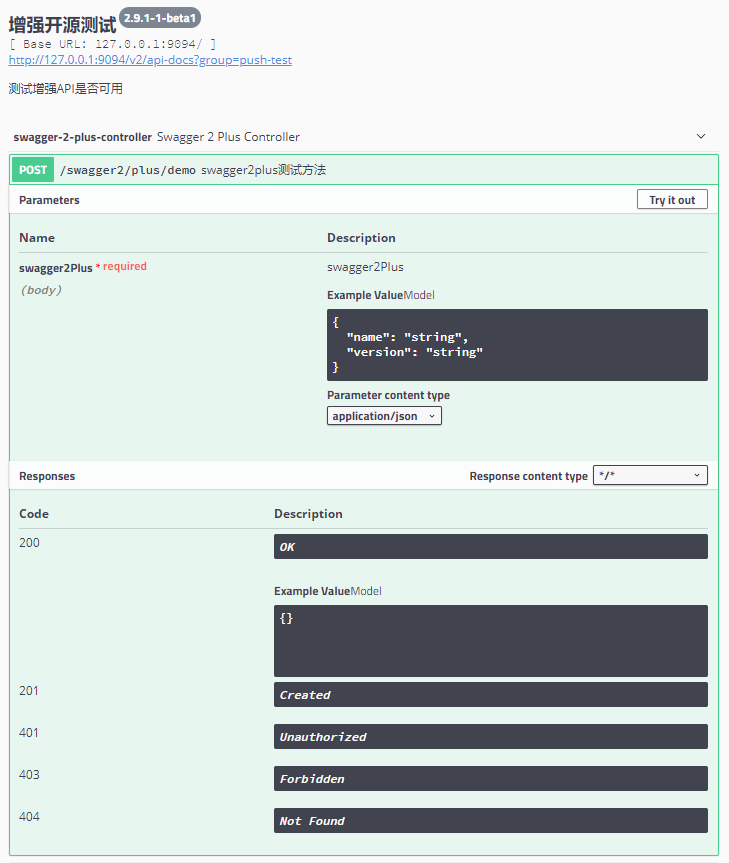
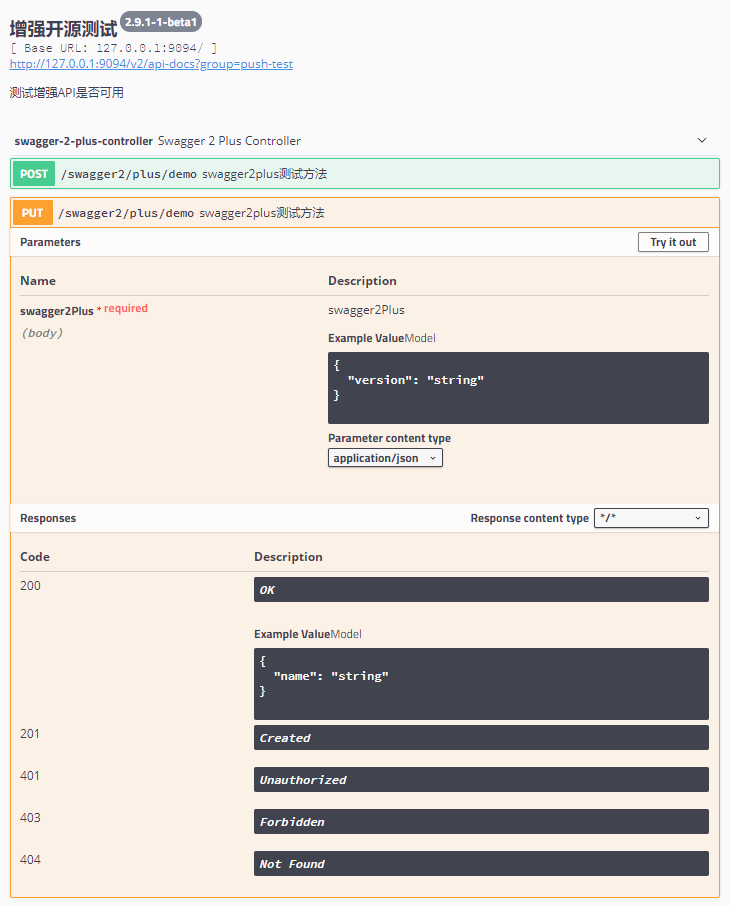

# SpringfoxSwagger2Plus(Swagger2增强)

作者: 魏广甫 


[](https://travis-ci.org/weiguangfu/springfox-swagger2-plus)
[](https://search.maven.org/artifact/cn.weiguangfu/springfox-swagger2-plus/2.9.1-1-beta2/jar)
[](http://www.apache.org/licenses/LICENSE-2.0.html)

作者邮箱: weiguangfu520@163.com

## 版本声明
首个-前为swagger2的版本, 优先使用与swagger2相同的版本, 默认引入springfox-swagger2-plus项目时自动引入swagger2对应的版本. springfox-swagger-ui会自动被引入.

## 快速开始
### 引入Maven项目
```
<dependency>
   <groupId>cn.weiguangfu</groupId>
   <artifactId>springfox-swagger2-plus</artifactId>
   <version>2.9.1-1-beta2</version>
</dependency>
```

### 开启API增强
```
/**
 * @EnableSwagger2Plus注解标志着开启Swagger2Plus, 
 * 此注解同时开启Swagger2的注解.
 */
@Configuration
@EnableSwagger2Plus
public class Swagger2Config {
    @Bean
    public Docket docket() {
        return new Docket(DocumentationType.SWAGGER_2).groupName("push-test")
                .apiInfo(new ApiInfoBuilder()
                        .title("增强开源测试")
                        .description("测试增强API是否可用")
                        .termsOfServiceUrl("")
                        .version("2.9.1-1-beta2")
                        .build())
                .directModelSubstitute(Byte.class, Integer.class)
                .select()
                .apis(RequestHandlerSelectors.basePackage("cn.weiguangfu.swagger2.plus.demo.controller"))
                .paths(PathSelectors.any())
                .build();
    }
}
```

### 配置文件开启Swagger2增强
* 此配置为了适应配置文件方式的profile, 可以配置停用线上swagger2的增强
```
# 此配置标志着开启增强, 目的是为了可以屏蔽线上Swagger2增强.
# 不编辑此配置或者值为enable: false则不开启Swagger2增强.
swagger:
  push:
    enable: true
```

### Controller接口配置
* @ApiPlus 接口增强注解 默认不增强
* @ApiGroup 接口方法注解 默认不增强
    * groups 区分接口的分组Class类标记
    * requestExecution 请求执行方式(包含: 默认参数中全部不展示, 排除: 默认参数全部展示),默认包含
    * responseExecution 响应执行方式(包含: 默认参数中全部不展示, 排除: 默认参数全部展示),默认包含
    
```
/**
 * @ApiPlus配置并且设置value=true表示开启当前Controller的API增强
 */
@RestController
@RequestMapping(value = "/swagger2/plus")
@ApiPlus(value = true)
@Api("swagger2plus测试类")
public class Swagger2PlusController {

    /**
     * @ApiGroup设置请求与响应的参数分组, 注解参数如下
     * 1. groups: 进行分组区别的Class对象.
     * 2. requestExecution: 请求执行方式 参见{@link cn.weiguangfu.swagger2.plus.enums.ApiExecutionEnum}
     * 3. responseExecution: 响应执行方式 参见{@link cn.weiguangfu.swagger2.plus.enums.ApiExecutionEnum}
     */
    @PostMapping("/demo")
    @ApiOperation("swagger2plus测试方法")
    @ApiGroup(groups = Swagger2PlusGroups.Demo.class, responseExecution = ApiExecutionEnum.EXCLUDE)
    public Swagger2Plus demo(@RequestBody Swagger2Plus swagger2Plus) {
        return swagger2Plus;
    }
}
```

### 请求与响应参数对象配置
* @ApiRequestInclude 请求包含配置, @ApiGroup中requestExecution配置为包含(ApiExecutionEnum.INCLUDE)时, 此注解生效
* @ApiRequestExclude 请求排除配置, @ApiGroup中requestExecution配置为排除(ApiExecutionEnum.EXCLUDE)时, 此注解生效
* @ApiResponseInclude 响应包含配置, @ApiGroup中responseExecution配置为包含(ApiExecutionEnum.INCLUDE)时, 此注解生效
* @ApiResponseExclude 响应排除配置, @ApiGroup中responseExecution配置为排除(ApiExecutionEnum.EXCLUDE)时, 此注解生效
```
@ApiModel("Swagger2增强对象")
public class Swagger2Plus {

    @ApiModelProperty("名称")
    @ApiRequestInclude(groups = {Swagger2PlusGroups.Demo.class})
    @ApiResponseExclude(groups = {Swagger2PlusGroups.Demo.class})
    private String name;

    @ApiModelProperty("版本")
    @ApiRequestInclude(groups = {Swagger2PlusGroups.Demo.class})
    @ApiResponseExclude(groups = {Swagger2PlusGroups.Demo.class})
    private String version;

    @ApiModelProperty("子Swagger2增强对象")
    private Swagger2Plus swagger2Plus;
    
    ...
}
```

### 增强效果如下




## 声明
此项目为作者首次开源项目, 如果有任何建议或者意见以及bug, 请留言或者发送至作者邮箱.
   
